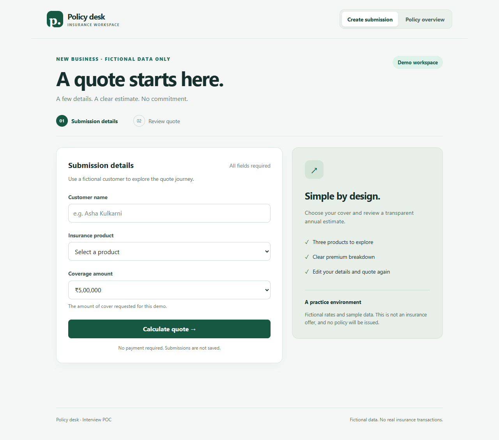
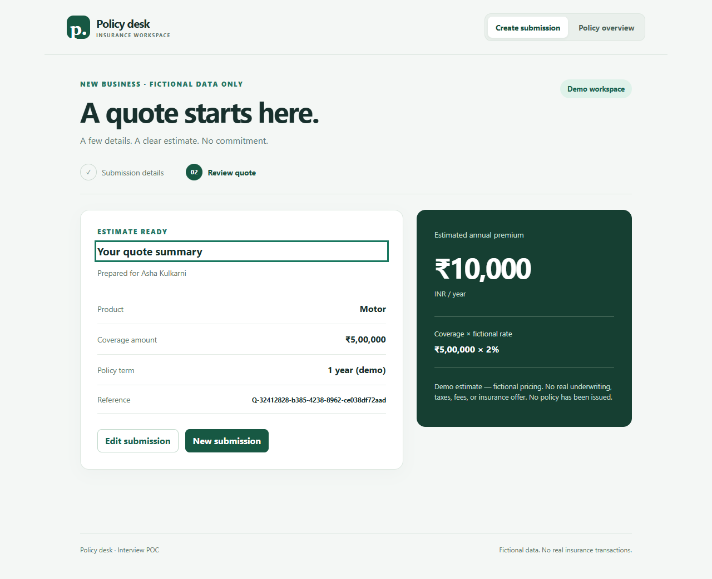
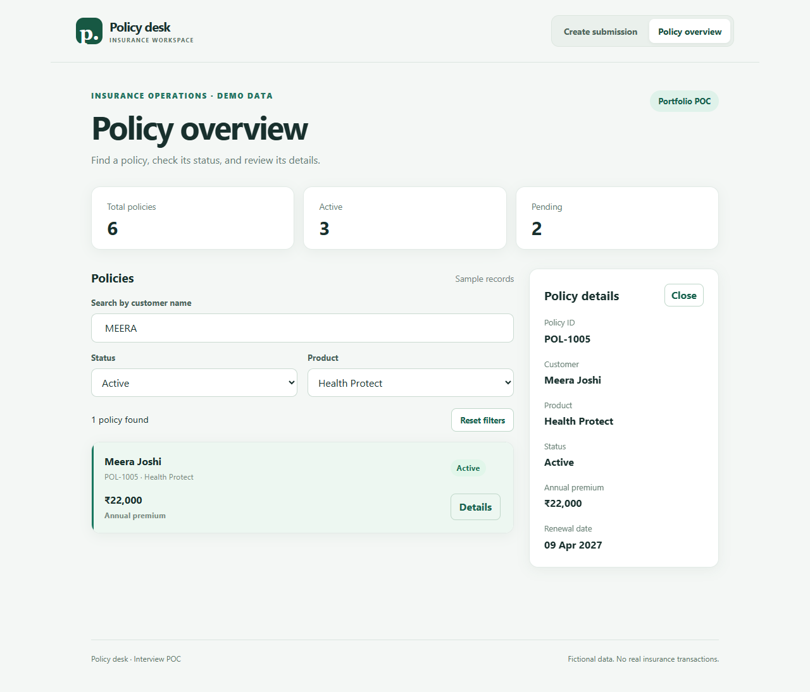

# Policy desk · Insurance submission & quote POC

A small React and TypeScript workspace for submitting fictional customer details, obtaining a server-calculated quote, and reviewing sample policies. Built for learning and interview demonstration. No employer code, real customer records, or insurer connections.

## UI preview

### Create a submission



### Quote summary



### Policy overview



## Run locally

From this directory (the one containing `package.json`):

```sh
npm ci
npm run dev
```

Open **http://127.0.0.1:5173**. One command starts Vite and the Node API at **http://127.0.0.1:3001**. Both ports must be free. Stop with Ctrl+C. Verified locally on Node 20.14.0; use a supported Node LTS release for a fresh setup.

```sh
npm test          # React/API-client tests, then real HTTP API tests
npm run typecheck # TypeScript checks
npm run build     # TypeScript checks + frontend production bundle
npm run lint      # JavaScript, TypeScript and React hook rules
npm run check     # Lint, unit/integration tests and build together
npx playwright install chromium # Once per machine
npm run test:e2e   # Real Chromium: desktop and mobile viewport journeys
```

`npm run api` starts only the API for standalone exploration. Do not run it alongside `npm run dev`, which already starts the API. The build creates frontend assets only: hosting `dist` alone does not deploy the API. GitHub Pages alone cannot host this complete flow.

Browser tests start the app automatically when it is not running. They exercise the actual API for successful quotes and deliberately intercept one request to check failure/retry. Reports and screenshots are generated in ignored output folders. Mobile tests emulate a viewport and touch device in Chromium; they do not establish real-device or Safari compatibility.

If the Chromium download is unavailable and Microsoft Edge is installed, PowerShell can run the same tests using Edge's Chromium engine:

```powershell
$env:PLAYWRIGHT_CHANNEL = 'msedge'
npm run test:e2e
Remove-Item Env:PLAYWRIGHT_CHANNEL
```

The GitHub Actions workflow installs dependencies, runs `npm run check`, and runs browser tests on Node 22. It uploads the browser report for review. Put this directory's contents at the repository root when publishing. A configured workflow is not evidence of a successful remote CI run until the repository is pushed and Actions completes.

## Demo journey

1. Open **Create submission**. Submit an empty form to see validation.
2. Enter a fictional customer, choose **Motor**, and leave coverage at **₹5,00,000**.
3. Select **Calculate quote**. The API returns an annual demo estimate of **₹10,000**.
4. Review the coverage, quote reference, and rate breakdown. **Edit submission** preserves inputs; **New submission** resets them.
5. Open **Policy overview** to combine customer search, status, and product filters. **Health Protect + Active + “meera”** finds Meera Joshi only.
6. Select **Details** to update the right-side panel (stacked on mobile), then try **Reset filters**. Portfolio counts always describe the full collection. Changing a filter clears the selection to avoid showing details outside the current results.

The draft and quote survive switching workspace views in this page. A refresh clears them. Quoting does not issue a policy or add a row to the policy overview.

## Architecture

```text
Controlled form → client validation → POST /api/quotes
  → Vite proxy → Node HTTP API → server validation + fictional pricing
  → 201 JSON → runtime response validation → React state → quote summary

Policy overview → GET /api/policies → fictional JSON seed data
  → runtime validation → React state → search/status filtering → JSX
```

| File | Responsibility |
| --- | --- |
| `src/App.tsx` | Navigation; keeps the submission mounted to preserve its draft |
| `src/QuoteSubmission.tsx` | Controlled inputs, validation, submission lifecycle, quote rendering |
| `src/quoteApi.ts` | Typed API contract, fetch, HTTP errors, runtime response checks |
| `server/app.mjs` | HTTP routes, JSON parsing, body limit, response status codes |
| `server/quotes.mjs` | Server validation and pure premium calculation |
| `src/PolicyList.tsx` | Policy fetch, validation, request states, combined filters and details |
| `e2e/workspace.spec.ts` | Real-browser journeys, keyboard focus, retry and responsive panel checks |
| `.github/workflows/ci.yml` | Automated lint, tests, build and browser checks on pushes and pull requests |
| `public/policies.json` | Six fictional seed records |
| `scripts/dev.mjs` | Starts and stops the two local servers |

The frontend uses TypeScript. The backend uses native Node JavaScript modules, avoiding additional dependencies and a separate server compilation step. Two views and a small data set do not require a router, global store, or query library.

## API contract

`GET /api/policies` returns the six sample policies with `200 OK`.

`POST /api/quotes` accepts `Content-Type: application/json`:

```json
{ "customerName": "Asha Kulkarni", "product": "Motor", "coverageAmount": 500000 }
```

Example `201 Created` response (reference varies):

```json
{
  "quoteId": "Q-example",
  "customerName": "Asha Kulkarni",
  "product": "Motor",
  "coverageAmount": 500000,
  "annualPremium": 10000,
  "ratePercent": 2,
  "currency": "INR"
}
```

Quotes are generated responses, not persisted resources; there is no retrieval endpoint. Errors include `400` malformed JSON, `413` oversized body, `415` unsupported content type, `422` invalid fields, `404` unknown route, `405` wrong method, and a generic `500` for unexpected failures. Validation errors include `fieldErrors` keyed by input name.

Customer names must contain 2–80 characters after trimming. Allowed coverage amounts: ₹1,00,000, ₹5,00,000, ₹10,00,000. Fictional annual rates: **Health 3%, Motor 2%, Home 1%**.

The server computes `Math.round(coverageAmount * rateBasisPoints / 10000)`, rounding to whole rupees for this demo. It ignores a client-supplied premium. This is not actuarial pricing and excludes real underwriting, taxes, fees, discounts, and eligibility rules.

## Verification and limits

Tests cover UI validation, pending duplicate-click prevention, review/edit/reset, retry, unmount cancellation, combined policy filters, API-client validation, and HTTP routes. Server tests use a real local HTTP server on an available port. Browser tests cover three journeys at desktop and mobile sizes, including keyboard focus, actual quotation requests, responsive panel placement, and a 320px overflow check.

Local verification: 12 component/API-client tests and 6 HTTP API tests passed; lint, TypeScript, and production build passed. All 6 browser scenarios passed headlessly in installed Microsoft Edge, and their desktop/mobile quote and policy screenshots were reviewed. The bundled Chromium download timed out locally, so that exact binary has not been verified here. This is not a full WCAG audit or a real-device compatibility certification.

- No database, saved submissions, authentication, authorization, payments, or policy issuance.
- The disabled button prevents repeated pending clicks; there is no server idempotency guarantee. Retrying can create another reference.
- Cancelling a browser request does not undo work already performed by the server.
- Policy validation checks structure, not all business rules such as unique IDs or valid dates.
- No production hosting, rate limiting, observability, or cross-origin deployment configuration.
- The earlier five npm advisories were resolved by updating Vite to 6.4.3 and Vitest to 4.1.11. The final local npm audit reported zero known vulnerabilities on 24 September 2026; future advisories can change that result. The lint parser is pinned for compatibility with the locally installed Node version.

## Learning guide

The useful interview evidence is what you can explain, modify, test, and debug yourself. This is a learning POC rather than production insurance software.

Start with the [complete code and interview guide](INTERVIEW_GUIDE.md) for the architecture, concepts, likely questions, model answers and study checklist. Use the shorter [code walkthrough](WALKTHROUGH.md) for a quick revision, then implement the **premium sorting** exercise to practise extending the existing filtering behavior.
